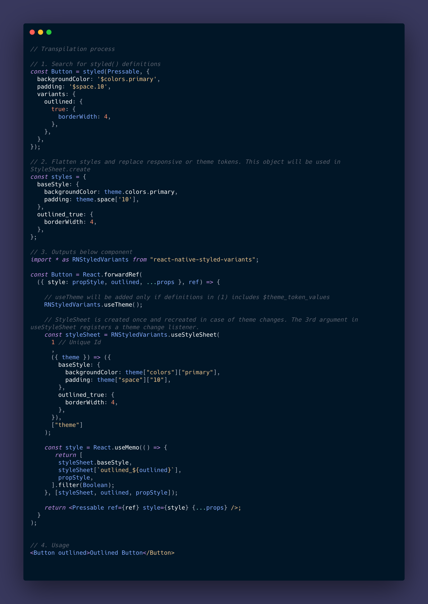

# React native styled variants

Create styled variants that are transpiled to StyleSheet during build time. (Utility props - In progress)


# Styled variants Transpilation flow



# Run example

```
cd repo/
yarn
cd repo/example
yarn
yarn web-clean

```

## License

MIT
